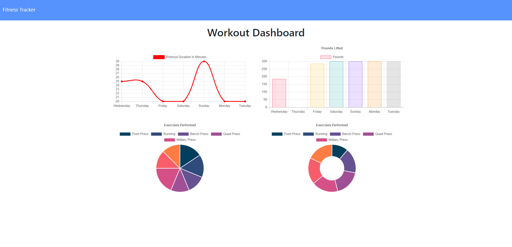

# Workout-Tracker


## Description
For homework assignment 17 I was tasked with creating a "Fitness Tracker" that enables a user to add workouts as a  part of their daily schedule. With this application, users are able to add new exercises and view their stats using the built in dashboard. This was a challenging assignment as I had to do a lot of research on how to use Mongoose aggregate to add new fields and calculate numbers to get totals. The hardest part was figuring out the "api-routes". 

## Table Of Contents
- [Technologies](#Technologies-Used)
- [Installation](#Installation)
- [Usage](#Usage)
- [Screenshot](#Screenshot)
- [View Live Website](#View-Live-Website)
- [Questions](#Questions)
- [License](#License)

## Technologies Used
For this application I used the following technologies: MongoDb, Heroku, JavaScript, HTML/CSS, Node Express, Travis-CI, Mongodb Atlas, Mongoose and Morgan

## Installation
This application is easy to install, just clone the repository and run the following command in your terminal. 

```
npm install
```

This will create the node modules folder you will need in order for this application to function correctly.

## Usage
In order to get this application to run you must open up the terminal and enter the following:

```
node server.js
```
The application will then console log the url in the terminal that you will need to access the application. 

```
Server listening on: http://localhost:8080
```

Simply copy paste http://localhost:8080 into a browser of your choice.

## Screenshot


## View Live Website  
Please click **[Here](https://infinite-forest-17979.herokuapp.com/)** to view the live webpage hosted on Heroku


## Questions
To view my other repositories or to connect with me on GitHub please click **[Here](https://github.com/HustinKava/)**
If you have any questions please feel free to reach out to me at the following email: *hkavafsd@gmail.com*

## License

